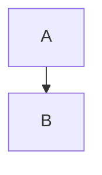

# Mermaid Node Spacing

An [Obsidian](https://obsidian.md/) plugin that **globally adjusts Mermaid flowchart node and rank spacing** in every diagram — no need to repeat `%%{init: ...}%%` in each code block.

## Before & After


The example above uses a simple `A → B` flowchart. With this plugin, **rank spacing** (vertical gap between rows) and **node spacing** (horizontal gap between nodes) are reduced globally, so long vertical charts take up less room in your notes.

## Why?

Mermaid's default flowchart layout uses generous spacing (`nodeSpacing: 50`, `rankSpacing: 50`). For note-taking workflows with many stacked nodes, that whitespace adds up quickly.

This plugin hooks into Obsidian's Mermaid API and merges your spacing preferences into every render — equivalent to adding this to each diagram:



## Settings

Open **Settings → Community plugins → Mermaid Node Spacing**:

| Setting       | Description                                      | Plugin default | Mermaid default |
|---------------|--------------------------------------------------|----------------|-----------------|
| Node spacing  | Horizontal distance between nodes on the same rank | `20`           | `50`            |
| Rank spacing  | Vertical distance between ranks (rows)           | `25`           | `50`            |

Changes apply immediately and re-render open Markdown preview panes.

## Installation

### Manual

1. Download or clone this repo.
2. Copy the `mermaid-spacing` folder into your vault's `.obsidian/plugins/` directory.
3. Enable **Mermaid Node Spacing** under **Settings → Community plugins**.
4. Reload Obsidian if prompted.

Your folder should look like:

```
.obsidian/plugins/mermaid-spacing/
├── main.js
├── manifest.json
└── ...
```

### From source

If you have the TypeScript source, build with your usual Obsidian plugin toolchain and copy the output `main.js` + `manifest.json` into the plugin folder.

## Compatibility

- **Obsidian**: 1.5.0+
- **Platforms**: Desktop and mobile (`isDesktopOnly: false`)

## License

MIT (or your preferred license — update as needed)

## Author

[isayaGIT](https://github.com/isayaGIT)
